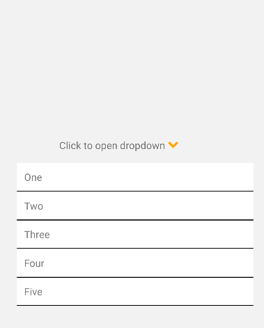

<div id="top"></div>


<!-- PROJECT LOGO -->
<br />

<h3 align="center">React Native Custom Dropdown Select</h3>


<div align="center">


</div>
  <p align="center">
    <br />
    <a href="https://github.com/shridharmanitripathi/react-native-custom-dropdown-select/issues">Report Bug</a>
    ·
    <a href="https://github.com/shridharmanitripathi/react-native-custom-dropdown-select/issues">Request Feature</a>
  </p>
</div>


<!-- TABLE OF CONTENTS -->
<details>
  <summary>Table of Contents</summary>
  <ol>
    <li>
      <a href="#getting-started">Getting Started</a>
      <ul>
        <li><a href="#prerequisites">Prerequisites</a></li>
        <li><a href="#Installation & Setup instructions for Functional components">Installation & Setup instructions for Functional components</a></li>
        <li><a href="#Installation & Setup instructions for Class based components">Installation & Setup instructions for Class based components</a></li>
      </ul>
    </li>
    <li><a href="#usage">Usage</a></li>
    <li><a href="#contributing">Contributing</a></li>
    <li><a href="#license">License</a></li>
    <li><a href="#contact">Contact</a></li>
  </ol>
</details>

<!-- GETTING STARTED -->
## Getting Started

 A simple and customizable React Native component for select with drop down and customizable styles

### Prerequisites

In order to use this package with a react antive app you will need the development environment configured for react native i.e., Node, the React Native command line interface, a JDK, and Android Studio.

### Installation & Setup instructions for Functional components:

1. Install the package in root directory of the project with : 
    ```
    npm i react-native-custom-dropdown-select
    ```
2. Let's import the dependency with:
   ```
   import DropDown from 'react-native-custom-dropdown-select';
   ```
3. In order to manage the toggling behaviour of dropdown we are going to make use of state, let's import that and initialise the state:
   ```
   import React,{useState} from 'react';

   const [selected, setSelected] = useState();
   ```
4. Styling the icon is optional :
   ```
   const iconColor = '#ffa500';
   const styleForIcon = {
      marginLeft: 80, color: iconColor
   }
   ```

5. Data can be passed down as props and can be defined in one of the two ways : 
    ```
    // Using key value
    const data = [
      { label: 'One', value: '1' },
      { label: 'Two', value: '2' },
      { label: 'Three', value: '3' },
      { label: 'Four', value: '4' },
      { label: 'Five', value: '5' },
      ];


    // Using arrays
    const data = [
      'one', 'two', 'three'
    ];
    ```
6.  Finally let's define a handler to log/ manipulate the data :
    ```
    const selectData = (value) => {
        setSelected(value);
        console.log('You selected ::>>', value);
    }
    ```
<p align="right">(<a href="#top">back to top</a>)</p>


### Installation & Setup instructions for Class based components:
1. Install the package in root directory of the project with : 
    ```
    npm i react-native-custom-dropdown-select
    ```
2. Let's import the dependency with:
   ```
   import DropDown from 'react-native-custom-dropdown-select';
   ```
3. In order to manage the toggling behaviour of dropdown we are going to make use of state, define the initial state:
   ```
   constructor(props) {
      super(props);
      this.state = {
        selected: null,   
      };
    }
   ```
4. Styling the icon is optional and the same can be done with inside render:
   ```
   const iconColor = '#ffa500';
   const styleForIcon = {
      marginLeft: 80, color: iconColor
   }
   ```
5. Data can be passed down as props and can be defined in one of the two ways : 
    ```
    // Using key value
    data: [
            { label: 'One', value: '1' },
            { label: 'Two', value: '2' },
            { label: 'Three', value: '3' },
            { label: 'Four', value: '4' },
            { label: 'Five', value: '5' },
        ],


    // Using arrays
      data: ['One', 'Two', 'Three']

    ```

<p align="right">(<a href="#top">back to top</a>)</p>


<!-- USAGE EXAMPLES -->
## Usage

Lets use the component
  ```
  <DropDown disabled={false} icon='ellipsis-h' data={data} onSelect={(value) => selectData(value)} iconStyle={styleForIcon} />

  ```
<p align="right">(<a href="#top">back to top</a>)</p>


<!-- CONTRIBUTING -->
## Contributing

Contributions are what make the open source community such an amazing place to learn, inspire, and create. Any contributions you make are **greatly appreciated**.

If you have a suggestion that would make this better, please fork the repo and create a pull request. You can also simply open an issue with the tag "enhancement".
Don't forget to give the project a star! Thanks again!

1. Fork the Project
2. Create your Feature Branch (`git checkout -b feature/AmazingFeature`)
3. Commit your Changes (`git commit -m 'Add some AmazingFeature'`)
4. Push to the Branch (`git push origin feature/AmazingFeature`)
5. Open a Pull Request

<p align="right">(<a href="#top">back to top</a>)</p>


<!-- LICENSE -->
## License

Distributed under the MIT License. See `LICENSE.txt` for more information.

<!-- CONTACT -->
## Contact

Project Link: [https://github.com/shridharmanitripathi/react-native-custom-dropdown-select](https://github.com/shridharmanitripathi/react-native-custom-dropdown-select)

<p align="right">(<a href="#top">back to top</a>)</p>